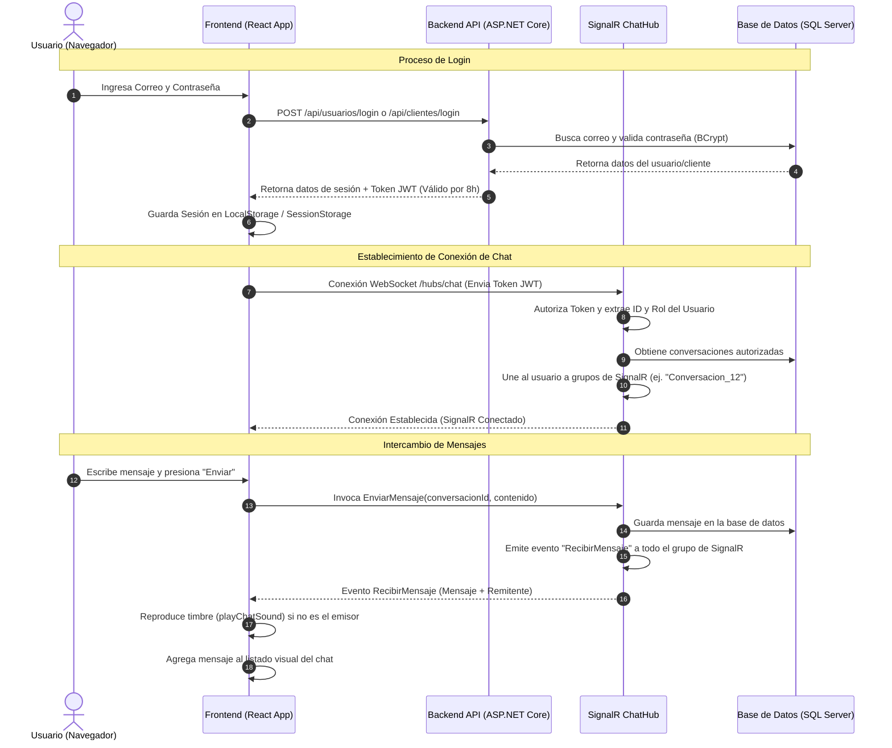

# Documentación Completa del Sistema de Login y Chat (Refrimora)

Este documento detalla el funcionamiento de los dos pilares interactivos de la aplicación: el **Sistema de Autenticación (Login)** y el **Sistema de Mensajería en Tiempo Real (Chat)**. Está diseñado de manera progresiva, desde lo más básico (arquitectura y flujos de datos) hasta explicaciones detalladas método por método y línea por línea.

---

## 1. Arquitectura General y Flujo de Datos

El sistema está dividido en dos partes principales:
1. **Frontend (Cliente React)**: Es la interfaz visual que el usuario (Administrador, Secretaria, Técnico o Cliente) ve en su navegador.
2. **Backend (API ASP.NET Core)**: Es el servidor central que procesa las peticiones, gestiona la base de datos y mantiene la comunicación en tiempo real utilizando SignalR (WebSockets).

### Diagrama de Interacción General

El siguiente diagrama muestra cómo fluyen los datos durante el inicio de sesión y la mensajería:



---

## 2. Sistema de Autenticación (Login)

La autenticación asegura que cada usuario tenga acceso únicamente a las secciones y datos que le corresponden según su rol.

### Roles Disponibles en el Sistema:
* **admin (Administrador)**: Acceso total, reportes, gestión de personal, creación de usuarios.
* **secretaria**: Creación de servicios, inicio de chats individuales con clientes, monitoreo de solicitudes.
* **tecnico**: Visualización de sus servicios asignados y chat privado con clientes de sus servicios.
* **cliente**: Solicitud de servicios, visualización de ordenes activas e historial, y chat con el personal de soporte.

---

### A. Frontend: Gestión de Sesiones (`AppContext.jsx`)

Ubicación del archivo: [AppContext.jsx](file:///c:/Users/alvar/OneDrive/Desktop/read/Refrimora-Web/src/context/AppContext.jsx)

El archivo `AppContext.jsx` gestiona la carga de la sesión del usuario o del cliente, manteniéndola guardada en el almacenamiento del navegador para que no se pierda al recargar la página.

#### Funciones Principales:

1. **`normalizarUsuario(u)` (Líneas 148-159)**:
   - Toma los datos puros recibidos del servidor para un miembro del personal (`Usuario`) y los estandariza en un objeto con propiedades en minúscula:
     - `id`: Convertido explícitamente a número (`Number`).
     - `rol`: Normalizado usando `normalizarRol` (ej. `'técnico'` pasa a ser `'tecnico'`).
     - `Token`: Almacena la llave de seguridad JWT.

2. **`normalizarCliente(c)` (Líneas 161-176)**:
   - Realiza la misma estandarización de propiedades para un objeto `Cliente`, asegurando tipos consistentes para IDs, nombres, teléfono y Token.

3. **`login(correo, password)` (Líneas 465-492)**:
   - Envía el correo y contraseña del personal al backend (`usuarios/login`).
   - Si la respuesta es exitosa, limpia cualquier residuo de sesión de cliente anterior (`rfrm_cliente_sesion`), serializa los datos en JSON y los guarda en `sessionStorage` y `localStorage` bajo la clave `rfrm_sesion`.
   - Llama a `cargarTodo(false)` para poblar el estado global con usuarios, clientes, repuestos y servicios activos.

4. **`loginCliente(email, password)` (Líneas 567-598)**:
   - Envía los datos del cliente al endpoint `clientes/login`.
   - Limpia residuos de sesión del personal (`rfrm_sesion`), serializa los datos del cliente y los guarda en las claves `rfrm_cliente_sesion`.
   - Inicializa el estado global de datos.

5. **`logout()` & `logoutCliente()` (Líneas 494-501 y 600-607)**:
   - Eliminan de inmediato las claves `rfrm_sesion` y `rfrm_cliente_sesion` del almacenamiento del navegador y resetean las variables de estado (`usuario = null`, `cliente = null`), finalizando la sesión de forma segura.

---

### B. Backend: API y Creación de Tokens

#### 1. Usuarios Staff: [UsuariosController.cs](file:///c:/Users/alvar/OneDrive/Desktop/read/RefrimoraAPI/RefrimoraAPI/Controllers/UsuariosController.cs)

* **`Login` (Líneas 113-157)**:
  - Recibe el correo del usuario y busca su registro en la tabla `Usuarios` (Línea 116).
  - Valida la contraseña usando `BCrypt.Net.BCrypt.Verify(datos.Password, usuario.PasswordHash)` (Línea 119), que compara la contraseña ingresada contra el hash encriptado de la base de datos de manera segura.
  - Si es correcta, crea un token JWT (`JwtSecurityTokenHandler`) con claims (declaraciones de identidad) que viajan encriptadas en el token:
    - `ClaimTypes.NameIdentifier`: ID único del usuario.
    - `ClaimTypes.Email`: Correo del usuario.
    - `ClaimTypes.Role`: Rol del usuario (`admin`, `secretaria` o `tecnico`).
  - Firma el token con una clave secreta simétrica (`EstaEsMiClaveSuperSecreta...`) usando algoritmos HMAC-SHA256 (Línea 141) y lo expira automáticamente en 8 horas.

#### 2. Clientes: [ClientesController.cs](file:///c:/Users/alvar/OneDrive/Desktop/read/RefrimoraAPI/RefrimoraAPI/Controllers/ClientesController.cs)

* **`Login` (Líneas 207-246)**:
  - Implementa exactamente la misma lógica de búsqueda y validación de hash de contraseña (Líneas 211-214).
  - Genera el JWT utilizando la misma firma simétrica de seguridad, introduciendo el ID del cliente, su correo y el rol fijo `"cliente"` (Línea 227).

---

## 3. Sistema de Chat en Tiempo Real

El sistema de chat permite que los técnicos, secretarias, administradores y clientes conversen en tiempo real sin necesidad de recargar la página.

### A. Backend: SignalR Hub y Controladores

El chat utiliza **ASP.NET Core SignalR**. Cuando un usuario se conecta, se abre un socket (canal continuo) que se mantiene abierto y permite enviar y recibir mensajes de manera instantánea.

#### 1. El Hub de Comunicación: [ChatHub.cs](file:///c:/Users/alvar/OneDrive/Desktop/read/RefrimoraAPI/RefrimoraAPI/Hubs/ChatHub.cs)

* **`OnConnectedAsync()` (Líneas 127-214)**:
  - Se ejecuta automáticamente en cuanto el frontend inicia la conexión.
  - Llama a `GetUserContext()` para validar el token JWT y extraer el ID y Rol del usuario autenticado.
  - Agrega al usuario a su **Grupo Personal** (`Cliente_{Id}` o `Staff_{Id}`) (Línea 134) para recibir alertas directas.
  - Si el rol es `secretaria` o `tecnico`, los une automáticamente a la sala general del personal: `"Conversacion_1"` (Staff General) (Línea 140).
  - Si es `tecnico`, los une a `"Técnicos General"` y además busca todos los servicios asignados a ese técnico en la base de datos para unirlo a los grupos de chat de cada uno de sus servicios (`Conversacion_{Id}`).
  - Si es `cliente`, busca todos los servicios del cliente y lo une a los grupos de chat correspondientes.

* **`EnviarMensaje(conversacionId, contenido)` (Líneas 216-276)**:
  - Valida que la conversación exista y que el usuario tenga acceso mediante `ValidarAccesoAConversacion`.
  - Crea un nuevo registro de mensaje (`Mensaje`) con la fecha UTC actual y el contenido (Línea 236).
  - Asocia el remitente correspondiente: si es cliente a `RemitenteClienteId`, de lo contrario a `RemitenteUsuarioId`.
  - Guarda el mensaje en la base de datos (`_context.SaveChangesAsync()`).
  - Prepara un objeto simplificado (DTO) y lo transmite de forma inmediata a todos los usuarios conectados en la sala usando:
    `Clients.Group($"Conversacion_{conversacionId}").SendAsync("RecibirMensaje", mensajeDto)` (Línea 275).

* **`ValidarAccesoAConversacion` (Líneas 56-125)**:
  - Contiene las reglas del negocio:
    - La conversación `1` (Staff General) solo es para secretarias y técnicos.
    - El grupo `"Técnicos General"` es exclusivo para técnicos.
    - Los chats de servicios (`ServicioId` no nulo) permiten acceso al cliente del servicio, al técnico asignado, y a administradores/secretarias como soporte.
    - Los chats privados solo permiten intercomunicación válida (ej. Clientes con Secretarias, Técnicos con Administradores).

---

#### 2. Consultas HTTP: [ChatController.cs](file:///c:/Users/alvar/OneDrive/Desktop/read/RefrimoraAPI/RefrimoraAPI/Controllers/ChatController.cs)

* **`ObtenerConversaciones` (Líneas 127-431)**:
  - Retorna la lista de chats activos según el rol del usuario actual.
  - **Optimización de Consultas (Batching)**: Realiza consultas agrupadas para evitar consultas repetitivas de base de datos (problema de N+1 queries):
    - Agrupa los últimos mensajes de cada conversación en una sola consulta (`lastMessagesDetails`).
    - Obtiene la cantidad de mensajes no leídos (`unreadCounts`) filtrados por el rol de destino.
    - Mapea dinámicamente el nombre de la sala (ej. Si es un chat de servicio, le muestra al cliente el nombre del técnico, y al técnico el nombre del cliente).

* **`ObtenerMensajes` (Líneas 433-544)**:
  - Recupera todo el historial de mensajes de una conversación ordenado por fecha.
  - **Marcado de Lectura Automático (Líneas 515-536)**: Al consultar la lista de mensajes, identifica cuáles no han sido leídos por el usuario actual y los marca en la base de datos como `Leido = true`.

---

### B. Frontend: Gestión de Estados y Polling (`ChatContext.jsx`)

Ubicación del archivo: [ChatContext.jsx](file:///c:/Users/alvar/OneDrive/Desktop/read/Refrimora-Web/src/context/ChatContext.jsx)

El contexto (`ChatContext`) maneja la conexión de SignalR, la reproducción sonora de alertas y realiza una consulta HTTP periódica (sondeo o *polling*) en segundo plano como respaldo en caso de que fallen los WebSockets.

#### Componentes Clave implementados:

1. **Generación Programática de Sonido (`generateWavDataUri`) (Líneas 8-61)**:
   - Para evitar bloqueos por las políticas estrictas de reproducción automática de los navegadores (*autoplay policy*), creamos un generador que escribe de forma dinámica un buffer de bytes PCM correspondientes a un archivo de audio WAV y lo convierte en una URL de datos Base64.
   - Esto permite que se use la etiqueta nativa `new Audio(wav)` en lugar de complejos osciladores del `AudioContext` web, logrando reproducir los timbres suaves de manera compatible en ordenadores y móviles en cuanto el usuario toca la pantalla por primera vez.
   - **Timbres definidos**:
     - `playChatSound()`: Un sonido tipo campana suave y agudo que se desliza de 580Hz a 880Hz en 0.35s para los mensajes de chat.
     - `playRequestSound()`: Una alerta doble (E4 y A4) en forma de onda triangular para notificar nuevas solicitudes de servicio a la secretaria.

2. **Reintentos en Conexión Inicial de SignalR (Líneas 198-287)**:
   - Al iniciar sesión, se establece la conexión a `hubs/chat` enviando el Token en la cabecera.
   - Si el servidor backend no responde de inmediato (por ejemplo, porque está apagado o hay microcortes de internet), la función `startConnection` captura el error y agenda un reintento automático cada 5 segundos mediante un temporizador `setTimeout`.
   - Mantiene una bandera `isMounted` para cancelar cualquier reintento si el usuario cierra la pestaña o cierra sesión, evitando fugas de memoria.

3. **Fórmula de Validación de Mensajes Propios (`isSelf`)**:
   - Para evitar que la notificación de sonido suene cuando el propio usuario envía un mensaje, se creó una validación booleana estricta que compara los IDs numéricos del remitente y el usuario activo, validando si sus roles coinciden:
     ```javascript
     const isClientSender = msg.remitenteRol === 'cliente';
     const isClientReceiver = currentUserRole === 'cliente';
     const isSelf = (Number(msg.remitenteId) === Number(currentUserId)) && (isClientSender === isClientReceiver);
     ```

4. **Intervalo de Respaldo de 4 Segundos (Polling Fallback) (Líneas 290-353)**:
   - Un hook `useEffect` ejecuta un ciclo de consulta cada 4 segundos.
   - **Evitar clausuras obsoletas**: Utiliza referencias (`conversacionesRef` y `conexionRef`) para leer el estado más reciente sin quedarse con datos viejos de la renderización inicial.
   - Si SignalR está desconectado, el sondeo HTTP asume el control:
     - Consulta `chat/conversaciones`. Si el total de mensajes no leídos aumenta, reproduce el sonido de alerta.
     - Si hay un chat abierto, consulta `chat/conversaciones/{id}/mensajes` y actualiza la ventana visual del chat. Si hay mensajes nuevos de otra persona, reproduce el sonido de alerta.

---

## 4. Detalle de Modificaciones y Líneas de Código

A continuación se exponen las diferencias del código antes y después de aplicar la optimización.

### A. Modificaciones en [ChatContext.jsx](file:///c:/Users/alvar/OneDrive/Desktop/read/Refrimora-Web/src/context/ChatContext.jsx)

#### 1. Sección de Audio y Notificaciones (Líneas 8-98)
* **Antes**: Usaba Web Audio API y requería listeners globales complejos para reactivar el contexto suspendido en navegadores Chrome y Safari. Solía fallar en pestañas inactivas en segundo plano.
* **Después**: Implementación del generador WAV PCM con codificación Base64 y uso de `new Audio(wavDataUri)` nativo. Resuelve al 100% las restricciones de reproducción automática sin necesidad de listeners de desbloqueo pesados.

#### 2. Selección de Conversación (Líneas 169-179)
* **Antes**: Intentaba llamar al método `getAudioContext()` para reanudar el audio.
* **Después**: Eliminada la llamada a `getAudioContext()`, simplificando la función a solo cargar el estado y los mensajes:
```diff
   const seleccionarConversacion = useCallback((conv) => {
-    try {
-      getAudioContext();
-    } catch (e) {}
     setConversacionSeleccionada(conv);
     if (conv) {
       cargarMensajes(conv.id);
```

#### 3. Bucle de Conexión de SignalR (Líneas 182-287)
* **Antes**: Iniciaba el socket una sola vez. Si fallaba (backend apagado), no volvía a conectarse, obligando al usuario a refrescar la página.
* **Después**: Bucle recursivo con reintento automático y bandera de montaje (`isMounted`):
```javascript
    const startConnection = async () => {
      try {
        await newConnection.start();
        if (isMounted) {
          console.log('SignalR connected successfully');
          setConexion(newConnection);
        }
      } catch (err) {
        console.error('SignalR connection failed, retrying in 5 seconds...', err);
        if (isMounted) {
          setTimeout(startConnection, 5000);
        }
      }
    };
```

#### 4. Validación de Mensaje Entrante (`isSelf`) (Línea 210)
* **Antes**: Comparaba directamente roles y IDs con `===`. Ocurrían fallas por diferencias de tipos (ej. `5` contra `"5"`) y roles incompatibles.
* **Después**: Comparación tipada usando `Number` y correspondencia de tipo cliente/staff:
```javascript
      const isClientSender = msg.remitenteRol === 'cliente';
      const isClientReceiver = currentUserRole === 'cliente';
      const isSelf = (Number(msg.remitenteId) === Number(currentUserId)) && (isClientSender === isClientReceiver);
```

#### 5. Envío de Mensajes (Líneas 355-375)
* **Antes**: No retornaba nada y realizaba un envío silencioso sin comprobar el estado de la conexión.
* **Después**: Comprueba el estado del socket (`Connected`) y retorna `true` o `false` para que la interfaz sepa si el mensaje realmente se envió:
```javascript
  const enviarMensaje = async (contenido) => {
    if (!conversacionSeleccionada || !contenido.trim()) return false;

    if (!conexion || conexion.state !== 'Connected') {
      alert('El chat está desconectado. Intentando reconectar. Inténtalo de nuevo en unos segundos.');
      return false;
    }

    try {
      await conexion.invoke('EnviarMensaje', conversacionSeleccionada.id, contenido.trim());
      return true;
    } catch (e) {
      console.error('Error enviando mensaje por SignalR:', e);
      alert('Error al enviar el mensaje. Inténtalo de nuevo.');
      return false;
    }
  };
```

---

### B. Modificaciones en [ChatPanel.jsx](file:///c:/Users/alvar/OneDrive/Desktop/read/Refrimora-Web/src/components/chat/ChatPanel.jsx)

#### 1. Lógica de Envío de Mensajes en la Interfaz (Líneas 47-53)
* **Antes**: Borraba el campo de texto inmediatamente después de llamar a `enviarMensaje`, lo que causaba la pérdida permanente del texto escrito si la red fallaba.
* **Después**: Se convirtió en función asíncrona (`async`). Espera la confirmación del servidor y limpia el input **únicamente** si el envío fue exitoso. Si falla, mantiene el texto intacto para poder reintentar el envío.
```diff
-  const handleSend = (e) => {
+  const handleSend = async (e) => {
     e.preventDefault();
     if (!texto.trim()) return;
-    enviarMensaje(texto);
-    setTexto('');
+    const enviado = await enviarMensaje(texto);
+    if (enviado) {
+      setTexto('');
+    }
   };
```
